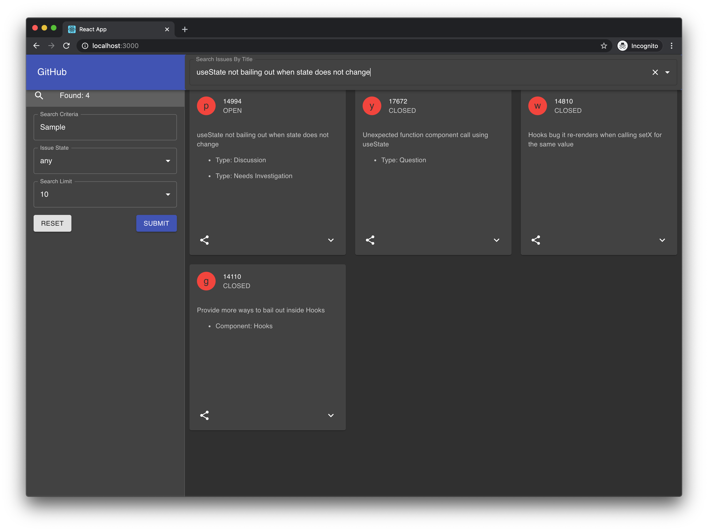

## GitSearch GraphQL Sample

Sample project to search Facebook React on GitHub using GraphQL API with auto-complete

* GitHub GraphQL Server
* Apollo GraphQL Client Library
* React (with Hooks)
* Material-UI
* Jest/Enzyme (for unit-testing)

Once yarn launches the application go to:

http://localhost:3000/

### To clone

    git clone https://github.com/nangchan/gitsearch.git

### To install

    cd gitsearch
    yarn install

### To setup

    update settings.js and add your github access token

    it should look something like:

    export const GITHUB_AUTH_TOKEN = 'a8fbc341def90a168d2fc3b291afe9a';

    To create an access token see https://help.github.com/en/github/authenticating-to-github/creating-a-personal-access-token-for-the-command-line

### To run the app

    yarn start

### To run the tests

    yarn test
